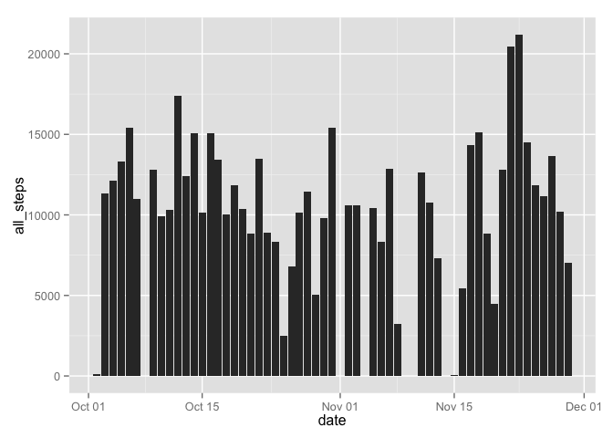
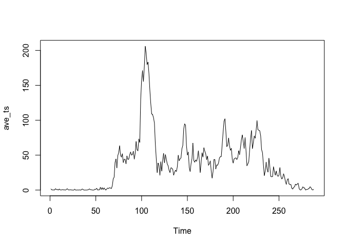
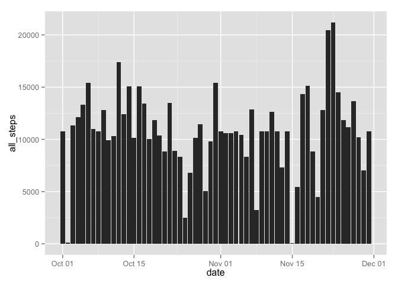
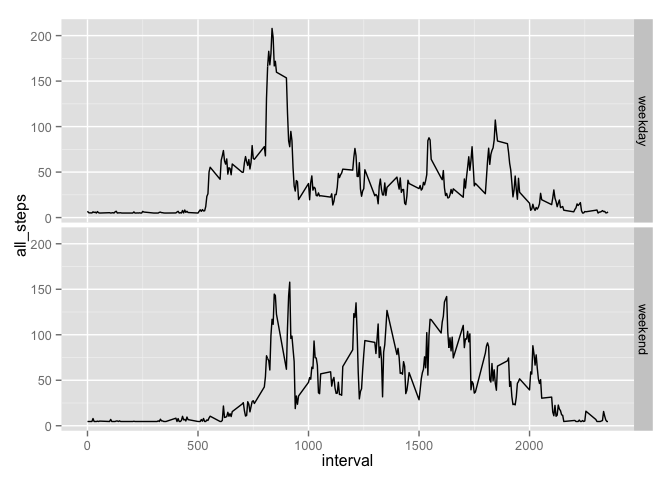

# Reproducible Research: Peer Assessment 1


## Loading and preprocessing the data


```r
library(dplyr)
```

```
## 
## Attaching package: 'dplyr'
## 
## The following object is masked from 'package:stats':
## 
##     filter
## 
## The following objects are masked from 'package:base':
## 
##     intersect, setdiff, setequal, union
```

```r
act_df <- read.csv("activity.csv", header = TRUE, na.strings = "NA") 
act_df$date <- as.POSIXct(act_df$date)
summary(act_df)
```

```
##      steps             date                        interval     
##  Min.   :  0.00   Min.   :2012-10-01 00:00:00   Min.   :   0.0  
##  1st Qu.:  0.00   1st Qu.:2012-10-16 00:00:00   1st Qu.: 588.8  
##  Median :  0.00   Median :2012-10-31 00:00:00   Median :1177.5  
##  Mean   : 37.38   Mean   :2012-10-31 00:25:34   Mean   :1177.5  
##  3rd Qu.: 12.00   3rd Qu.:2012-11-15 00:00:00   3rd Qu.:1766.2  
##  Max.   :806.00   Max.   :2012-11-30 00:00:00   Max.   :2355.0  
##  NA's   :2304
```

## What is mean total number of steps taken per day?

```r
library(ggplot2)
```

```
## Warning: package 'ggplot2' was built under R version 3.1.3
```

```r
per_day <- act_df %>%
    tbl_df() %>%
    filter(!is.na(steps)) %>%
    group_by(date) %>%
    summarize(all_steps = sum(steps))
mean_per_day <- mean(per_day$all_steps)
median_per_day <- median(per_day$all_steps)
p <- ggplot(per_day, aes(date, all_steps)) + geom_histogram(stat="identity")
print(p)
```

 

The average number of steps per day is 1.0766189\times 10^{4} and the median of the same is 10765

## What is the average daily activity pattern?


```r
per_interval <- act_df %>%
    tbl_df() %>%
    filter(!is.na(steps)) %>%
    group_by(interval) %>%
    summarize(ave_steps = mean(steps))
ave_ts = ts(per_interval$ave_steps)
plot.ts(ave_ts)
```

 

```r
max_ave_steps <- max(per_interval$ave_steps)
max_interval_idx <- which.max(per_interval$ave_steps)
max_interval <- per_interval$interval[max_interval_idx]
```
The maximum average number of steps taken in a five minute interval is 206.1698113 during the interval 104

## Imputing missing values


```r
# The strategy to replace the missing NA values is to: 
#  - calculate the mean of the average steps per interval
#  - replace the NA values with the mean calculated above
mean_interval_steps <- mean(per_interval$ave_steps)
imputed_act_df <- act_df %>% 
    mutate(imputed_steps = 
               ifelse(is.na(steps), 
                      mean_interval_steps, 
                      steps))
# Since the next section (weekend vs weekday) will use the resultant 
# data frame, I saved the data frame with the replaced NA first before
# calculating the mean per day in dplyr
imputed_mean_per_day <- imputed_act_df %>%
    tbl_df() %>%
    group_by(date) %>%
    summarize(all_steps = sum(imputed_steps))
imp_mean_per_day <- mean(imputed_mean_per_day$all_steps)
imputed_median_per_day <- median(imputed_mean_per_day$all_steps)
p <- ggplot(imputed_mean_per_day, aes(date, all_steps)) + geom_histogram(stat="identity")
print(p)
```

 

The average number of steps per day is 1.0766189\times 10^{4} and the median of the same is 1.0766189\times 10^{4}

The interesting part of this result is when the NA values are replaced with the average number of steps per interval, the mean value is unchanged, but the median value is now equal to the mean.

## Are there differences in activity patterns between weekdays and weekends?

```r
daytype_act_df <- imputed_act_df %>%
    tbl_df() %>%
    mutate(day_type = ifelse(weekdays(date) == "Sunday" | weekdays(date) == "Saturday", "weekend", "weekday")) %>%
    group_by(interval, day_type) %>%
    summarise(all_steps = mean(imputed_steps))
par(mfrow=c(2,1))
sp <- ggplot(daytype_act_df, aes(interval, all_steps)) + geom_line()
sp <- sp + facet_grid(day_type ~ .)
print(sp)
```

 
